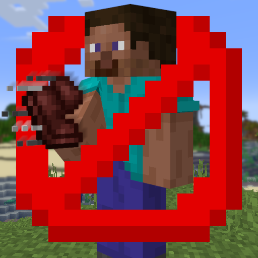

# Stop Dropping Sprint

   
   
  

A simple mod that prevents sticky keybinds to be toggled when used in key combos.

Its name comes from the one vanilla use-case where the way sticky keybinds work normally bothers me: dropping an entire stack with sprinting set to toggle causes it to also toggle sprint.

It *should* work on any Minecraft version from snapshot 19w41a (where sticky keybinds where added) to the latest version (but in case it doesn't work, feel free to [open an issue here](https://github.com/val-int1/stop_dropping_sprint/issues)), and only requires Fabric Loader version 0.15.0 or above.

It works by doing two changes:

1. It makes sticky keybinds toggle on *release* instead of on press
   
   

2. It prevents toggling if another key was pressed before release
   
   
